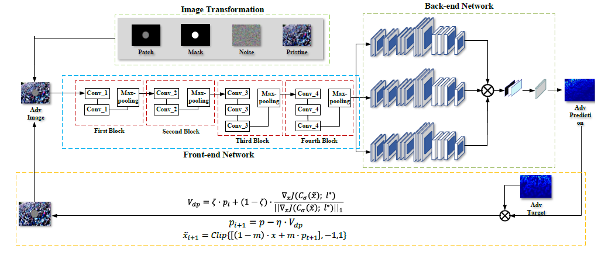
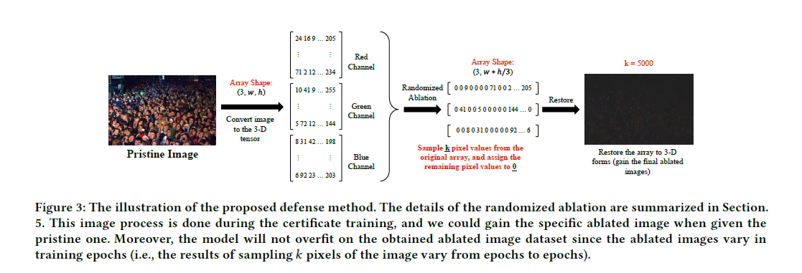
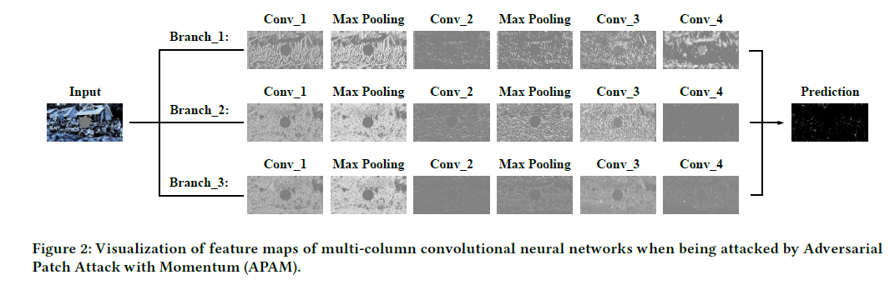
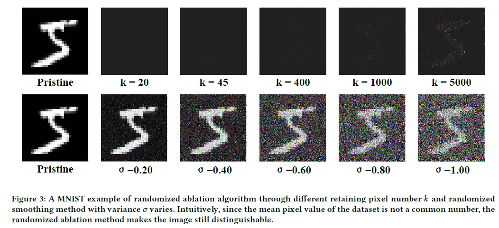

# Towards Adversarial Patch Analysis and Certified Defense against Crowd Counting
```
paper address: https://arxiv.org/abs/2104.10868
```
> This work is done when working as the research asistant in Big Data Security and Information Itelligence Lab, supervised by Prof.[Pan Zhou](https://scholar.google.com/citations?user=cTpFPJgAAAAJ&hl=en). And we corperate with the researchers in Duke University ([Dr.Wang](https://wangbinghui.net) and [Dr.Li](https://sites.duke.edu/angli)). 
> From my perspectives, the most important problem in the robustness of regression modeling (not just the crowd counting models) is how to define the robustness evaluation metrics? I have already given some answers but I think this is still the open problem (actually, researchers still use the specific evaluation metrics on specific tasks like miou in semantic segmentations). Therefore, we pick the crowd counting models to find some possible answers and the tight-MAE/MSE evaluation metric is relatively general across the vision models (we give the more detailed discussions in our latest paper submitted to BMVC 2021).

* This is the official implementation code of paper submitted to ACM MM 2021.

* We are the first work to evaluate the adversarial robustness of crowd counting both theoretically and empirically.

* Thanks for the insightful discussions with [Weizhe Liu](https://weizheliu.github.io) (the author of Coxtext-Aware-Crowd-Counting, CVPR2019)

* Thanks for the repo of [Optical Flow Attack (ICCV2019)](https://github.com/anuragranj/flowattack), this repo is inspired from it. 

* Thanks for the repo of [Randomized Ablation (AAAI2020)](https://github.com/alevine0/randomizedAblation)

## Requirement
1. Install pytorch 1.4.0+
2. Python 3.7+

## Data Setup
follow the MCNN or CSRNet repo's steps to build the dataset [MCNN](https://github.com/svishwa/crowdcount-mcnn) [CSRNet](https://github.com/CommissarMa/CSRNet-pytorch)

Download ShanghaiTech Dataset from
[Dropbox](https://www.dropbox.com/s/fipgjqxl7uj8hd5/ShanghaiTech.zip?dl=0) or [Baidu Disk](https://pan.baidu.com/s/101mNo_Vz21IwDYnYTnLQpw) (code: a2v8)   

## Attacked Models
CSRNet: https://github.com/CommissarMa/CSRNet-pytorch

CAN: https://github.com/CommissarMa/Context-Aware_Crowd_Counting-pytorch

MCNN: https://github.com/svishwa/crowdcount-mcnn

CMTL: https://github.com/svishwa/crowdcount-cascaded-mtl

DA-Net: https://github.com/BigTeacher-777/DA-Net-Crowd-Counting

Thanks for these researchers sharing the codes!


## How to Attack?
Please run the python file patch_attack.py

## How to Retrain the Crowd Counting Models?
python3 MCNN_adv_train.py (adversarial training with the generated patch (pristine version))
python3 MCNN_certify_train.py (certificate training MCNN via randomized ablation)

## Want to Gain the Certificate Retrained Models and Want More Disscussions on the Robustness Problem on Regression Learning?
The latest ## suppplementary materials ##: \
dropbox: [dropbox](https://www.dropbox.com/sh/s9v8ojj7pedz4vr/AAChLahRjJ_-ko6kefsSD47ba?dl=0)

The certificate retrained crowd counting models: \
dropbox: [dropbox](https://www.dropbox.com/home/ACM%20MM2021%20pretrained%20models)

## Reference
If you find the paper is useful, please cite : 
```
@article{wu2021towards,
  title={Towards Adversarial Patch Analysis and Certified Defense against Crowd Counting},
  author={Wu, Qiming and Zou, Zhikang and Zhou, Pan and Ye, Xiaoqing and Wang, Binghui and Li, Ang},
  journal={arXiv preprint arXiv:2104.10868},
  year={2021}
}
```

## More Details
* the attack process of victim crowd counting models: \


* illustrate the defense approach: \


* the internal changes of victim models when being attacked (model: MCNN): \


* comparison results of randomized ablation and randomized smoothing: \


## "I want to try the randomized ablation method on my model and dataset"
* use the command to abtain the single ablated image and then you can extend it to the dataset:
```
python3 get_ablated_img.py
```
(when k is larger, the consuming time is longer ^_^)
* use the command to run the certificate training (you should config some settings, explore them yourselves):
```
python3 MCNN_certify_train.py
```
* before ablation: \
 
* after ablation: \


## Reference
If you find the paper is useful, please cite : 
```
@article{wu2021towards,
  title={Towards Adversarial Patch Analysis and Certified Defense against Crowd Counting},
  author={Wu, Qiming and Zou, Zhikang and Zhou, Pan and Ye, Xiaoqing and Wang, Binghui and Li, Ang},
  journal={arXiv preprint arXiv:2104.10868},
  year={2021}
}
```
